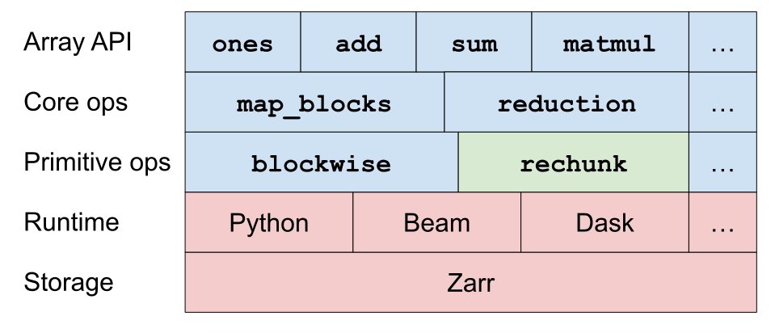

# Cubed

Codename: Barry

**_Note: this is a proof-of-concept, and many things are incomplete or don't work._**

## Fixed-memory serverless distributed N-dimensional array processing

Cubed is a distributed N-dimensional array library implemented in Python using fixed-memory serverless processing and Zarr for storage.

- Implements the [Python Array API standard](https://data-apis.org/array-api/latest/) (see [coverage status](./api_status.md))
- Guaranteed maximum memory usage for standard array functions
- [Zarr](https://zarr.readthedocs.io/en/stable/) for storage
- Multiple serverless runtimes: Python, [Apache Beam](https://beam.apache.org/), [Lithops](https://lithops-cloud.github.io/)

## Example

```python
>>> import cubed
>>> import cubed.random
>>> spec = cubed.Spec(work_dir="tmp", max_mem=100_000)
>>> a = cubed.random.random((4, 4), chunks=(2, 2), spec=spec)
>>> b = cubed.random.random((4, 4), chunks=(2, 2), spec=spec)
>>> c = cubed.matmul(a, b)
>>> c.compute()
array([[1.22171031, 0.93644194, 1.83459119, 1.8087655 ],
       [1.3540541 , 1.13054495, 2.24504742, 2.05022751],
       [0.98211893, 0.62740696, 1.21686602, 1.26402294],
       [1.58566331, 1.33010476, 2.3994953 , 2.29258764]])
```

See more in the [demo notebook](./examples/demo.ipynb).

See the [examples README](./examples/README.md) for more about running on cloud services.

## Motivation

Managing memory is one of the major challenges in designing and running distributed systems. Computation frameworks like Apache Hadoop's MapReduce, Apache Spark, Beam, and Dask all provide a general-purpose processing model, which has lead to their widespread adoption. Successful use at scale however requires the user to carefully configure memory for worker nodes, and to understand how work is allocated to workers, which breaks the high-level programming abstraction. A disproportionate amount of time is often spent tuning the memory configuration of a large computation.

A common theme here is that most interesting computations are not embarrassingly parallel, but involve shuffling data between nodes. A lot of engineering effort has been put into optimizing the shuffle in Hadoop, Spark, Beam (Google Dataflow), and to a lesser extent Dask. This has undoubtedly improved performance, but has not made the memory problems go away.

Another approach has started gaining traction in the last few years. [Lithops](https://lithops-cloud.github.io/) (formerly Pywren) and [Rechunker](https://rechunker.readthedocs.io/), eschew centralized systems like the shuffle, and do everything via serverless cloud services and cloud storage.

Rechunker is interesting, since it implements a very targeted use case (rechunking persistent N-dimensional arrays), using only stateless (serverless) operations, with guaranteed memory usage. Even though it can run on systems like Beam and Dask, it deliberately avoids passing array chunks between worker nodes using the shuffle. Instead, all bulk data operations are reads from, or writes to, cloud storage (Zarr in this case). Since chunks are always of known size it is possible to tightly control memory usage, thereby avoiding unpredictable memory use at runtime.

This project is an attempt to go further: implement all distributed array operations using a fixed-memory serverless model.

## Design

Cubed is composed of five layers: from the storage layer at the bottom, to the Array API layer at the top:



Blue blocks are implemented in Cubed, green in Rechunker, and red in other projects like Zarr and Beam.

Let's go through the layers from the bottom:

### Storage

Every _array_ in Cubed is backed by a Zarr array. This means that the array type inherits Zarr attributes including the underlying store (which may be on local disk, or a cloud store, for example), as well as the shape, dtype, and chunks. Chunks are the unit of storage and computation in this system.

### Runtime

Cubed uses external runtimes for computation. It follows the Rechunker model (and uses its API) to delegate tasks to stateless executors, which include Python (in-process), Beam, Dask, Lithops, and Prefect.

### Primitive operations

There are a small number of primitive operations on arrays:

<dl>
  <dt><code>blockwise</code></dt>
  <dd>Applies a function to multiple blocks from multiple inputs, expressed using concise indexing rules.</dd>
  <dt><code>rechunk</code></dt>
  <dd>Changes the chunking of an array, without changing its shape or dtype.</dd>
  <dt>indexing</dt>
  <dd>Subsets an array, along one or more axes.</dd>
</dl>

(This list may need to be expanded to support structural operations, like concatenation.)

### Core operations

These are built on top of the primitive operations, and provide functions that are needed to implement all array operations.

<dl>
  <dt><code>map_blocks</code></dt>
  <dd>Applies a function to corresponding blocks from multiple inputs.</dd>
  <dt><code>reduction</code></dt>
  <dd>Applies a function to reduce an array along one or more axes.</dd>
  <dt><code>arg_reduction</code></dt>
  <dd>A reduction that returns the array indexes, not the values.</dd>
</dl>

Note that these operations are all included in Dask, and Dask uses them as building blocks to implement a large subset of the NumPy API.

### Array API

The new [Python Array API](https://data-apis.org/array-api/latest/) was chosen for the public API as it provides a useful, well-defined subset of the NumPy API. There are a few extensions, including Zarr IO, random number generation, and operations like `map_blocks` which are heavily used in Dask applications.

## Features

<dl>
  <dt>Task failure handling</dt>
  <dd>If a task fails - with an IO exception when reading or writing to Zarr, for example - it will be retried (up to a total of three attempts).</dd>
  <dt>Resume a computation from a checkpoint</dt>
  <dd>Since intermediate arrays are persisted to Zarr, it is possible to resume a computation without starting from scratch. To do this, the Cubed <code>Array</code> object should be stored persistently (using <code>pickle</code>), so it can be reloaded in a new process and then <code>compute()</code> called on it to finish the computation.</dd>
  <dt>Straggler mitigation</dt>
  <dd>A few slow running tasks (called stragglers) can disproportionately slow down the whole computation. To mitigate this, speculative duplicate tasks are launched in certain circumstances, acting as backups that complete more quickly than the straggler, hence bringing down the overall time taken. <b>[Not yet implemented]</b></dd>
</dl>

## Implementation

Cubed has a lazy computation model. As array functions are invoked, a computation _plan_ is built up, and it is only executed when explicitly triggered with
a call to `compute`, or when implicitly triggered by converting an array to an in-memory (NumPy) or on-disk (Zarr) representation.

A `Plan` object is a directed acyclic graph (DAG), where the nodes are arrays and the edges express primitive operations. For example, one array may be rechunked to another using a `rechunk` operation. Or a pair of arrays may be added together using a `blockwise` operation.

Of the primitive operations, `blockwise`, `rechunk`, and indexing operations all have memory requirements that are known ahead of time. Each operation runs a _task_ to compute each chunk of the output. The memory needed for each task is a function of chunk size, dtype, and the precise nature of the operation, but it can be computed before the whole operation is run, while building the plan. The user is required to specify the maximum amount of memory that tasks can use, and if the computation would exceed that amount, an exception is raised during the planning phase. This means that the user can have high confidence that the operation will run reliably.

A plan is executed by traversing the DAG and materializing arrays by writing them to Zarr storage. Details of how a plan is executed depends on the runtime. Distributed runtimes, for example, may choose to materialize arrays that don't depend on one another in parallel for efficiency.

This processing model has advantages and disadvantages. One advantage is that since there is no shuffle involved, it is a straightforward model that can scale up with very high-levels of parallelism - for example in a serverless environment. This also makes it straightforward to make it run on multiple execution engines - the implementation here uses an adapation of Rechunker which supports local Python, Beam, Dask, and Prefect out of the box.

The main disadvantage of this model is that every intermediate array is written to storage, which can be slow. However, there are opportunities to optimize the DAG before running it (such as map fusion).

## Comparison with Dask

Dask is a ["flexible library for parallel computing in Python"](https://docs.dask.org/en/latest/). It has several components: Dask Array, Dask DataFrame, Dask Bag, and Dask Delayed. Cubed supports only distributed arrays, corresponding to Dask Array.

Dask converts high-level operations into a task graph, where tasks correspond to chunk-level operations. In Cubed, the computational graph (or plan) is defined at the level of array operations and is decomposed into fine-grained tasks by the primitive operators for the runtime. Higher-level graphs are more useful for users, since they are easier to visualize and reason about. (Dask's newer High Level Graph abstraction is similar.)

Dask only has a single distributed runtime, Dask Distributed, whereas Cubed has the advantage of running on a variety of distributed runtimes, including more mature ones like Google Cloud Dataflow (a Beam runner).

The core operations and array API layers in Cubed are heavily influenced by Dask Array - in both naming, as well as implementation (Cubed has a dependency on Dask Array for some chunking utilities).

## Previous work

This project is a continuation of a similar project I worked on, called [Zappy](https://github.com/lasersonlab/zappy/tree/master/zappy). What's changed in the intervening three years? Rechunker was created (I wasn't so concerned with memory when working on Zappy). The Python Array API standard has been created, which makes implementing a new array API less daunting than implementing the NumPy API. And I have a better understanding of Dask, and the fundamental nature of the blockwise operation.

## Development

Create an environment with

```shell
conda create --name cubed python=3.8
conda activate cubed
pip install -r requirements.txt
```
