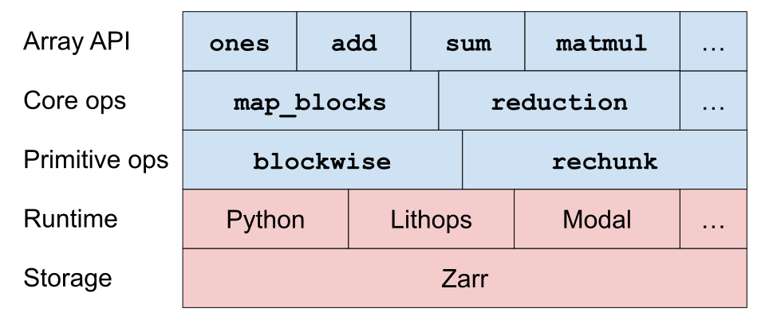

# Design

Cubed is composed of five layers: from the storage layer at the bottom, to the Array API layer at the top:



Blue blocks are implemented in Cubed; red blocks in other projects like Zarr and Lithops.

Let's go through the layers from the bottom:

## Storage

Every _array_ in Cubed is backed by a Zarr array. This means that the array type inherits Zarr attributes including the underlying store (which may be on local disk, or a cloud store, for example), as well as the shape, dtype, and chunks. Chunks are the unit of storage and computation in this system.

## Runtime

Cubed uses external runtimes for computation, delegating tasks to stateless executors, which include Python (in-process), Lithops, Modal, and Apache Beam.


## Primitive operations

There are two primitive operations on arrays:

```{eval-rst}
.. currentmodule:: cubed.primitive.blockwise
.. autosummary::
    :nosignatures:

    blockwise
.. currentmodule:: cubed.primitive.rechunk
.. autosummary::
    :nosignatures:

    rechunk
```

## Core operations

These are built on top of the primitive operations, and provide functions that are needed to implement all array operations.

```{eval-rst}
.. currentmodule:: cubed.core.ops
.. autosummary::
    :nosignatures:

    elemwise
    map_blocks
    map_selection
    reduction
    arg_reduction
```

## Array API

The new [Python Array API](https://data-apis.org/array-api/latest/) was chosen for the public API as it provides a useful, well-defined subset of the NumPy API. There are a few extensions, including Zarr IO, random number generation, and operations like `map_blocks` which are heavily used in Dask applications.
