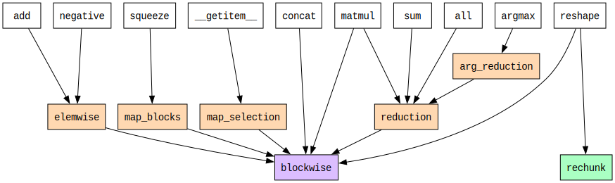

# Operations

Here we look in more depth at the core and primitive operations in Cubed.

## Dependency Tree

The following diagram shows the dependencies between operations. Array API functions are shown at the top (in white), the core operations are in the middle (in orange), and the primitive operations are at the bottom (`blockwise` in pink and `rechunk` in green). Not all Array API functions are shown, just a representative selection.

Note how fundamental `blockwise` is - all array API functions depend on it.

(elemwise-operation)=
## `elemwise`

The simplest core operation is `elemwise`, which maps input array elements to output array elements, a block at a time.

* Preserves: `shape`, `chunks`, `numblocks`
* __Multiple__ inputs, __single__ output

It is a core operation that is implemented using `blockwise`.

Here's an example with two inputs, such as for `add`. (Arrows are only shown for two input blocks, in order to avoid cluttering the diagram.)

(Note that `elemwise` supports broadcasting, but that is not shown here.)

## `map_blocks`

Like `elemwise`, `map_blocks` operates on corresponding input blocks, but they need not match in shape, and the output block shape may differ too.

* Preserves: `numblocks`
* __Multiple__ inputs, __single__ output

It is a core operation that is implemented using `blockwise`.

This example shows how the `squeeze` operation is implemented using `map_blocks` (with a single input). Note that although the number of blocks is preserved, the shape and chunk size of the output is different to the input since the second dimension is dropped.

## `map_selection`

The `map_selection` operation selects subsets of an input array using standard NumPy indexing notation.

* No input array attributes are preserved in general
* __Single__ input, __single__ output

It is a core operation that is implemented using `blockwise` on the output's blocks. It works by converting indexing selections, such as slices, to keys that refer to blocks in the input array, then retrieving these blocks, slicing them, and assembling them into the final output block.

This example shows how `index` is implemented using `map_selection`. Each block in the output array is read directly from one or more blocks from the inputs.

Note: previously, operations that now use `map_selection` were written using `map_direct`, which allowed input arrays to be read directly. The main difference between the two operations is that `map_selection` tracks which blocks are read by the operation, which allows the optimizer to fuse operations. This is unlike `map_direct`, which does not provide information about block inputs, and therefore cannot be fused by the optimizer.

## `blockwise`

The `blockwise` operation is a primitive operation that operates on input array blocks, while allowing an input block to be sent to multiple output blocks.

* No input array attributes are preserved in general
* __Multiple__ inputs, __single__ output

This example shows how `outer` is implemented using `blockwise`. Each block from the input is sent to three blocks in the output. (Arrows are only shown for two input blocks, in order to avoid cluttering the diagram.)

Note: the `general_blockwise` operation is a more general form of `blockwise` that uses a function to specify the block mapping, rather than an index notation, and which supports multiple outputs.

* No input array attributes are preserved in general
* __Multiple__ inputs, __multiple__ outputs

For multiple outputs, all output arrays must have matching `numblocks`.

(rechunk-operation)=
## `rechunk`

The `rechunk` operation is a primitive operation for changing the chunking of an array, without changing its shape or dtype.

* Preserves: `shape`, `dtype`
* __Single__ input, __single__ output

This example shows how there is no one-to-one correspondence between blocks in the input and output. In general, an output block is composed of parts of many input blocks. Consult [this page on the rechunker algorithm](https://rechunker.readthedocs.io/en/latest/algorithm.html) for details of how it is implemented.

## `reduction` and `arg_reduction`

The `reduction` operation reduces an array along one or more axes.

* No input array attributes are preserved in general
* __Single__ input, __single__ output

It is a core operation that is implemented using a `blockwise` operation called `partial_reduce` that reads multiple blocks and performs the reduction operation on them.
The `partial_reduce` operations are arranged in a tree (`tree_reduce`) with multiple rounds until there's a single block in each reduction axis. Finally an aggregrate `blockwise` operation is applied to the results.

Here is an example of reducing over the first axis, with two rounds of `partial_reduce` operations:

The `arg_reduction` works similarly, but uses different functions to return indexes rather than values.
