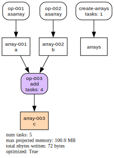
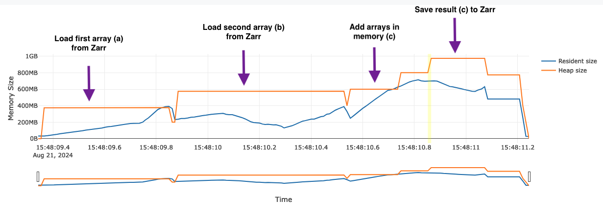

# Diagnostics

Cubed provides a variety of tools to understand a computation before running it, to monitor its progress while running, and to view performance statistics after it has completed.

To use these features ensure that the optional dependencies for diagnostics have been installed:

```shell
pip install "cubed[diagnostics]"
```

## Visualize the computation plan

Before running a computation, Cubed will create an internal plan that it uses to compute the output arrays.

The plan is a directed acyclic graph (DAG), and it can be useful to visualize it to see the number of steps involved in your computation, the number of tasks in each step (and overall), and the amount of intermediate data written out.

The {py:meth}`Array.visualize() <cubed.Array.visualize()>` method on an array creates an image of the DAG. By default it is saved in a file called *cubed.svg* in the current working directory, but the filename and format can be changed if needed. If running in a Jupyter notebook the image will be rendered in the notebook.

If you are computing multiple arrays at once, then there is a {py:func}`visualize <cubed.visualize>` function that takes multiple array arguments.

This example shows a tiny computation and the resulting plan:

```python
import cubed.array_api as xp
import cubed.random

a = xp.asarray([[1, 2, 3], [4, 5, 6], [7, 8, 9]], chunks=(2, 2))
b = xp.asarray([[1, 2, 3], [4, 5, 6], [7, 8, 9]], chunks=(2, 2))
c = xp.add(a, b)

c.visualize()
```



There are two type of nodes in the plan. Boxes with rounded corners are operations, while boxes with square corners are arrays.

In this case there are three operations (labelled `op-001`, `op-002`, and `op-003`), which produce the three arrays `a`, `b`, and `c`. (There is always an additional operation called `create-arrays`, shown on the right, which Cubed creates automatically.)

Array `c` is coloured orange, which means it is materialized as a Zarr array. Arrays `a` and `b` do not need to be materialized as Zarr arrays since they are small constant arrays that are passed to the workers running the tasks.

Similarly, the operation that produces `c` is shown in a lilac colour to signify that it runs tasks to produce the output. Operations `op-001` and `op-002` don't run any tasks since `a` and `b` are just small constant arrays.


## Callbacks

You can pass callbacks to functions that call `compute`, such as {py:func}`store <cubed.store>` or {py:func}`to_zarr <cubed.to_zarr>`.

### Progress bar

You can display a progress bar to track your computation by passing callbacks to {py:meth}`compute() <cubed.Array.compute()>`:

```ipython
>>> from cubed.diagnostics.rich import RichProgressBar
>>> progress = RichProgressBar()
>>> c.compute(callbacks=[progress])  # c is the array from above
  create-arrays 1/1 ━━━━━━━━━━━━━━━━━━━━━━━━━━━━━━━━━━━━━━━━━━━━━ 100.0% 0:00:00
  op-003 add    4/4 ━━━━━━━━━━━━━━━━━━━━━━━━━━━━━━━━━━━━━━━━━━━━━ 100.0% 0:00:00
```

The two current progress bar choice are:
- `from cubed.diagnostics.rich import RichProgressBar`
- `from cubed.diagnostics.tqdm import TqdmProgressBar`


This will work in Jupyter notebooks, and for all executors.


### History
The history callback can be used to understand how long tasks took to run, and how much memory they used. The history callback will write [`events.csv`, `plan.csv` and `stats.csv`] to a new directory under the current directory with the schema `history/compute-{id}`.


```ipython
>>> from cubed.diagnostics.history import HistoryCallback
>>> hist = HistoryCallback()
>>> c.compute(callbacks=[hist])
```


### Timeline
The timeline visualization is useful to determine how much time was spent in worker startup, as well as how much stragglers affected the overall time of the computation. (Ideally, we want vertical lines on this plot, which would represent perfect horizontal scaling.)

The timeline callback will write a graphic `timeline.svg` to a directory with the schema `history/compute-{id}`.


```ipython
>>> from cubed.diagnostics.timeline import TimelineVisualizationCallback
>>> timeline_viz = TimelineVisualizationCallback()
>>> c.compute(callbacks=[timeline_viz])
```

### Examples in use
See the [examples](../examples/index.md) for more information about how to use them.

## Memray

[Memray](https://github.com/bloomberg/memray), a memory profiler for Python, can be used to track and view memory allocations when running a single task in a Cubed computation.

This is not usually needed when using Cubed, but for developers writing new operations, improving projected memory sizes, or for debugging a memory issue, it can be very useful to understand how memory is actually allocated in Cubed.

To enable Memray memory profiling in Cubed, simply install memray (`pip install memray`). Then use a local executor that runs tasks in separate processes, such as `processes` (Python 3.11 or later) or `lithops`. When you run a computation, Cubed will enable Memray for the first task in each operation (so if an array has 100 chunks it will only produce one Memray trace).

Here is an example of a simple addition operation, with 200MB chunks. (It is adapted from [test_mem_utilization.py](https://github.com/cubed-dev/cubed/blob/main/cubed/tests/test_mem_utilization.py) in Cubed's test suite.)

```python
import cubed.array_api as xp
import cubed.random

a = cubed.random.random(
    (10000, 10000), chunks=(5000, 5000), spec=spec
)  # 200MB chunks
b = cubed.random.random(
    (10000, 10000), chunks=(5000, 5000), spec=spec
)  # 200MB chunks
c = xp.add(a, b)
c.compute(optimize_graph=False)
```

The optimizer is turned off so that generation of the random arrays is not fused with the add operation. This way we can see the memory allocations for that operation alone.

After the computation is complete there will be a collection of `.bin` files in the `history/compute-{id}/memray` directory - with one for each operation. To view them we convert them to HTML flame graphs as follows:

```shell
(cd $(ls -d history/compute-* | tail -1)/memray; for f in $(ls *.bin); do echo $f; python -m memray flamegraph --temporal -f -o $f.html $f; done)
```

Here is the flame graph for the add operation:



Annotations have been added to explain what is going on in this example. Note that reading a chunk from Zarr requires twice the chunk memory (400MB) since there is a buffer for the compressed Zarr block (200MB), as well as the resulting array (200MB). After the first chunk has been loaded the memory dips back to 200MB since the compressed buffer is no longer retained.
