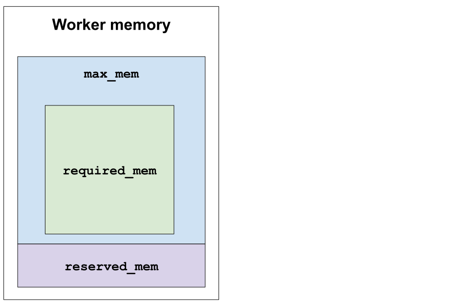

# Memory

Cubed aims to tightly manage the amount of memory that each task uses, ensuring that it never exceeds a configured maximum.

The various memory settings and values are illustrated in the following diagaram, and are discussed further below.



## Allowed memory

You should set ``allowed_mem`` to the maximum amount of memory that is available to the Cubed runtime. When running locally this should be no more than the amount of memory you have available on your machine. For cloud services it should be the amount of memory that the container runtime is configured to use.

In this example we set the allowed memory to 2GB:

```python
import cubed

spec = cubed.Spec(allowed_mem="2GB")
```

## Projected memory

The output of a Cubed computation is a chunked Zarr array (or set of arrays). Tasks are run by workers to operate on Zarr chunks, and the memory needed for each task is a function of chunk size, dtype, and the nature of the operation, which can be computed while building the plan.

While it is not possible in general to compute the precise amount of memory that will be used (since it is not known ahead of time how well a Zarr chunk will compress, for example), it is possible to put a conservative upper bound on the memory usage. This upper bound is the `projected_mem` for a task, and it is calculated automatically by Cubed.

If the `projected_mem` calculated by Cubed is greater than the value of `allowed_mem` that you have set, then an exception is raised during the planning phase. This check means that you can have high confidence that the operation will run within its memory budget.

## Reserved memory

There is another memory setting that can help Cubed manage memory properly: `reserved_mem`. This is the amount of memory reserved on a worker for non-data use - it's whatever is needed by the Python process for running a task.

Cubed provides a utility function, {py:func}`measure_reserved_mem <cubed.measure_reserved_mem>`, for measuring it for the runtime you are using. You can run this function first, then use the value it reports as the basis for setting `reserved_mem` for your computation. Cubed will use `reserved_mem` as a baseline when calculating `projected_mem`, in order to more accurately estimate the upper bound on memory usage, making it more likely that your computation doesn't exceed memory bounds.

Some executors have the ability to measure memory as a task is running. They can report the `peak_measured_mem`, which is the highest actual memory usage for a given task during its execution. This information is useful for analysing how well the computation ran, and if there is room for improvement (in Cubed's algorithms for calculating `projected_mem`).

## Chunk sizes

As a rule of thumb `allowed_mem` should be at least ten times as large as your Zarr chunk sizes.

This because when operating on a chunk a task has to

1. read the compressed chunk from the input Zarr array,
2. decompress the chunk,
3. perform an operation on the decompressed chunk to produce a new array, and
4. compress the new array to write to the output Zarr array.

So a basic operation like this requires up to four times as much memory as the chunk itself. More complex operations can require more memory, and in particular reduction operations like `sum` or `mean` can work more efficiently if there is more memory available.

A common container size is around 2GB, so this is a reasonable size for setting `allowed_mem`. In this case a good chunk size would be 100MB, which is a factor of 20 smaller than `allowed_mem`, allowing plenty of room for reduction operations.
