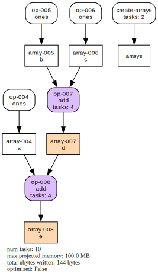

# Optimization

Cubed will automatically optimize the computation graph before running it. This can reduce the number of tasks in the plan, and the amount of intermediate IO, both of which speed up the computation.

## Map fusion

The simplest kind of optimization is _map fusion_, where operations that have one preceding operation with the same number of tasks are fused together. This optimization is enabled by default.

You can see the effect of optimization before running any computation by using the `visualize` method on a Cubed array, such as in the following small example. We start by specifying `optimize_graph=False` to turn off optimization so we can see what the unoptimized plan looks like.

```python
import cubed.array_api as xp

a = xp.asarray([[1, 2, 3], [4, 5, 6], [7, 8, 9]], chunks=(2, 2))
b = xp.negative(a)
c = xp.astype(b, xp.float32)

c.visualize("cubed-unoptimized", optimize_graph=False)
```


Now we call `visualize` again, this time not setting `optimize_graph` so it picks up its default value of `True`.

```python
c.visualize()
```


Note that with optimization turned on, the array `b` is no longer written as an intermediate output since it will be computed in the same tasks that compute array `c`. The overall number of tasks is reduced from 10 to 5, and the intermediate data (total `nbytes`) is reduced too.

Here we have just called `visualize` with the `optimize_graph` argument, but it's possible to use it when calling `compute` - which can be useful when debugging a computation.

```python
c.compute(optimize_graph=False)
```

## Multiple-input fusion

Cubed supports more powerful optimizations, such as for when an array is created from multiple input arrays. Here is an example, shown first with optimization turned off.

```python
import cubed.array_api as xp

a = xp.ones((3, 3), chunks=(2, 2))
b = xp.ones((3, 3), chunks=(2, 2))
c = xp.ones((3, 3), chunks=(2, 2))
d = xp.add(b, c)
e = xp.add(a, d)

e.visualize("cubed-unoptimized", optimize_graph=False)
```



And with optimization turned on (the default):

```python
e.visualize()
```


Notice how the array `d` is fused away.

## Debugging optimization

Sometimes it can be difficult to understand why particular operations in a computation plan have been fused together - or more commonly, why they have *not* been fused. By enabling debug logging you can get detailed information from the optimize function to help you understand which operations are being fused - or not - and the reason in either case.

Here's the previous example with logging enabled:

```python
import logging

logging.basicConfig(level=logging.DEBUG)

e.visualize()
```

The output explains which operations can or can't be fused, and why:

```
DEBUG:cubed.core.optimization:can't fuse op-001 since it is not a primitive operation, or it uses an operation that can't be fused (concat or stack)
DEBUG:cubed.core.optimization:can't fuse op-002 since it is not a primitive operation, or it uses an operation that can't be fused (concat or stack)
DEBUG:cubed.core.optimization:can't fuse op-003 since it is not a primitive operation, or it uses an operation that can't be fused (concat or stack)
DEBUG:cubed.core.optimization:can't fuse op-004 since no predecessor ops can be fused
DEBUG:cubed.primitive.blockwise:can fuse op-005 since num tasks of predecessor ops match
```

## Advanced settings

There are limits to how many input arrays and input chunks reads are fused together. These are imposed so that the number of reads that an individual task must perform is not excessive, which would otherwise result in slow running tasks.

In some cases you may want to change these limits, which we look at here.

### Total number of source arrays

Cubed will not fuse operations that result in more than 4 source arrays in the fused operation. In the previous example above the fused operation has three source arrays (`a`, `b`, and `c`), which is below the maximum default allowed. On the other hand, a computation with a higher "fan-in" that exceeds the maximum will not be fused, or operations will be fused in stages.

To change this, we have to specify the `optimize_function` that Cubed should use: `multiple_inputs_optimize_dag`. In addition, we use `fuctools.partial` to set the `max_total_source_arrays` argument to 8 as follows:

```python
from functools import partial
from cubed.core.optimization import multiple_inputs_optimize_dag

opt_fn = partial(multiple_inputs_optimize_dag, max_total_source_arrays=8)
e.visualize(optimize_function=opt_fn)
```

### Total number of input blocks

The `max_total_num_input_blocks` argument to `multiple_inputs_optimize_dag` specifies the maximum number of input blocks (chunks) that are allowed in the fused operation.

Again, this is to limit the number of reads that an individual task must perform. If set to `None`, operations are fused only if they have the same number of tasks. If set to an integer (the default is 10), then tasks with a different number of tasks will be fused - as long as the total number of input blocks does not exceed the maximum. This setting is useful for reductions, and can be changed using `functools.partial`:

```python
opt_fn = partial(multiple_inputs_optimize_dag, max_total_num_input_blocks=20)
e.visualize(optimize_function=opt_fn)
```
