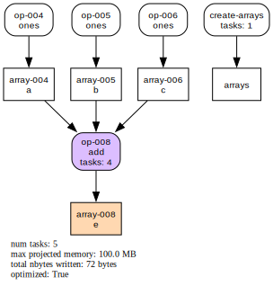

# Optimization

Cubed will automatically optimize the computation graph before running it. This can reduce the number of tasks in the plan, and the amount of intermediate IO, both of which speed up the computation.

## Map fusion

The simplest kind of optimization is _map fusion_, where operations that have one preceding operation with the same number of tasks are fused together. This optimization is enabled by default.

You can see the effect of optimization before running any computation by using the `visualize` method on a Cubed array, such as in the following small example. We start by specifying `optimize_graph=False` to turn off optimization so we can see what the unoptimized plan looks like.

```python
import cubed.array_api as xp

a = xp.asarray([[1, 2, 3], [4, 5, 6], [7, 8, 9]], chunks=(2, 2))
b = xp.negative(a)
c = xp.astype(b, xp.float32)

c.visualize("cubed-unoptimized", optimize_graph=False)
```


Now we call `visualize` again, this time not setting `optimize_graph` so it picks up its default value of `True`.

```python
c.visualize()
```


Note that with optimization turned on, the array `b` is no longer written as an intermediate output since it will be computed in the same tasks that compute array `c`. The overall number of tasks is reduced from 10 to 5, and the intermediate data (total nbytes) is reduced too.

## Advanced optimization

Cubed supports more powerful optimizations, but these are not (currently) enabled by default. This section explains what they are and how you can try them out.

Map fusion is limited to the cases where there is a single preceding input with the same number of tasks. However, many computations have a branching structure, and the default optimization doesn't help in such cases. Here is an example, where even though optimization is enabled, it doesn't have any effect.

```python
import cubed.array_api as xp

a = xp.ones((3, 3), chunks=(2, 2))
b = xp.ones((3, 3), chunks=(2, 2))
c = xp.ones((3, 3), chunks=(2, 2))
d = xp.add(b, c)
e = xp.add(a, d)

e.visualize()
```


To overcome this limitation we can use the `optimize_function` argument, which allows us to specify the function that performs optimization. Here we use the `multiple_inputs_optimize_dag` function that can handle multiple inputs.

```python
from cubed.core.optimization import multiple_inputs_optimize_dag

e.visualize(optimize_function=multiple_inputs_optimize_dag)
```



Notice how the array `d` is fused away.

The `multiple_inputs_optimize_dag` function has a couple of parameters to control how it works:

`max_total_source_arrays` specifies the maximum number of source arrays that are allowed in the fused operation, in order to limit the number of reads that an individual task must perform.

The default is 4. In the previous example above the fused operation has three source arrays (`a`, `b`, and `c`), which is below the maximum default allowed. On the other hand, a computation with a higher "fan-in" that exceeds the maximum will not be fused, or operations will be fused in stages.

To change this setting, you can use Python's `functools.partial` as follows:

```python
opt_fn = partial(multiple_inputs_optimize_dag, max_total_source_arrays=8)
visualize(optimize_function=opt_fn)
```

`max_total_num_input_blocks` specifies the maximum number of input blocks (chunks) that are allowed in the fused operation.

Again, this is to limit the number of reads that an individual task must perform. The default is `None`, which means that operations are fused only if they have the same number of tasks. If set to an integer, then this limitation is removed, and tasks with a different number of tasks will be fused - as long as the total number of input blocks does not exceed the maximum. This setting is useful for reductions, and can be set using `functools.partial`:

```python
opt_fn = partial(multiple_inputs_optimize_dag, max_total_num_input_blocks=10)
visualize(optimize_function=opt_fn)
```

## Debugging optimization

For the advanced optimizations it can be difficult to understand why particular operations in a computation plan have been fused together - or more commonly, why they have *not* been fused. By enabling debug logging you can get detailed information from the optimize function to help you understand which operations are being fused - or not - and the reason in either case.

Here's the previous example with logging enabled:

```python
import logging

logging.basicConfig(level=logging.DEBUG)

e.visualize(optimize_function=multiple_inputs_optimize_dag)
```

The output explains which operations can or can't be fused, and why:

```
DEBUG:cubed.core.optimization:can't fuse op-001 since it is not fusable
DEBUG:cubed.core.optimization:can't fuse op-002 since it is not fusable
DEBUG:cubed.core.optimization:can't fuse op-003 since it is not fusable
DEBUG:cubed.core.optimization:can't fuse op-004 since no predecessor ops can be fused
DEBUG:cubed.primitive.blockwise:can fuse op-005 since num tasks of predecessor ops match
```
